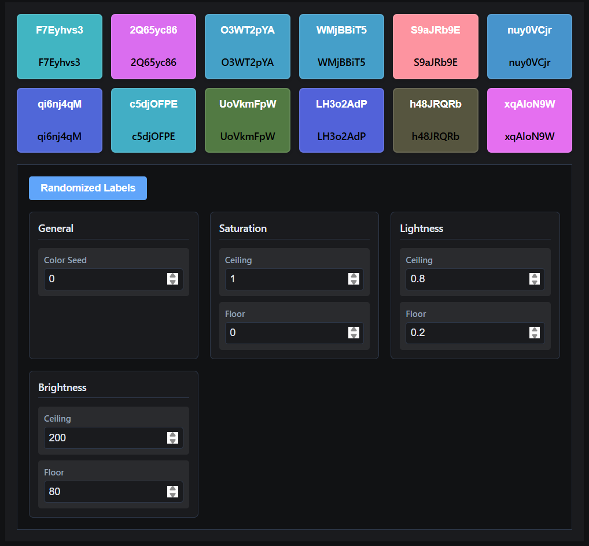

# KeyColor

KeyColor is a .NET library that generates unique and consistent colors based on input keys. It's perfect for applications that need deterministic color generation, such as data visualization, user interfaces, and color-coded elements.

If you find this project helpful, please consider giving it a star! ⭐

## Features

- **Deterministic Color Generation**: Same input always produces the same color
- **Type Support**: Generate colors from strings, byte arrays, or structs
- **Customizable Parameters**: Control saturation, lightness, and brightness ranges
- **Framework Support**: 
  - .NET 9.0
  - .NET 8.0
  - .NET 7.0
  - .NET Standard 2.0
- **High Performance**: Optimized for both modern and legacy .NET frameworks
- **Thread Safety**: Static `ColorFrom` APIs are thread-safe, `KeyColorGenerator` has thread-safe color generation

## Demo



Try out the [live demo](https://brave-bush-06f230610.6.azurestaticapps.net/) to see KeyColor in action!

All parameters update in real-time, letting you see how they affect the generated colors.

## Installation

Install KeyColor via NuGet:

```bash
dotnet add package KeyColor
```

## Quick Start

```csharp
// Using string as input
var color1 = ColorFrom.String("uniqueKey");
string cssColor1 = color1.ToCssColor(); // Returns "#RRGGBB"

// Using struct as input
var myStruct = new MyStruct();
var color2 = ColorFrom.Key(myStruct);

// Using byte array as input
byte[] data = new byte[] { 1, 2, 3 };
var color3 = ColorFrom.Span(data);

// Generate random color
var randomColor = ColorFrom.Rng();
```

## Advanced Usage

### Customizing Color Generation

```csharp
var generator = new KeyColorGenerator();

// Customize saturation range (0-1)
generator.Saturation.Min = 0.3;
generator.Saturation.Max = 0.7;

// Customize lightness range (0-1)
generator.Lightness.Min = 0.2;
generator.Lightness.Max = 0.8;

// Customize brightness range (0-255)
generator.Brightness.Min = 80;
generator.Brightness.Max = 200;

// Generate color with custom settings
var color = generator.GetUniqueColor("myKey");
```


## API Reference

### ColorFrom (Static Class)

- `String(string key)`: Generate color from string input
- `Key<T>(T key) where T : struct`: Generate color from struct
- `Span<T>(ReadOnlySpan<T> span) where T : struct`: Generate color from span
- `Rng()`: Generate random color

All methods in `ColorFrom` are thread-safe and can be safely called from multiple threads.

### KeyColorGenerator (Class)

- `GetUniqueColor(string label)`: Generate color from string
- `GetUniqueColor<T>(T key) where T : struct`: Generate color from struct
- `GetUniqueColor(ReadOnlySpan<byte> key)`: Generate color from byte span

**Thread Safety Note**: The color generation methods are thread-safe, but modifying properties (Seed, Saturation, Lightness, Brightness) is not thread-safe. If you need to modify these properties, do it before making the generator available to multiple threads.

### GeneratedColor (Struct)

- `R`: Red component (0-255)
- `G`: Green component (0-255)
- `B`: Blue component (0-255)
- `ToArray()`: Convert to byte array
- `ToCssColor()`: Convert to CSS color string


## Performance

Here's a performance comparison of `ColorFrom.Key<struct>` across different .NET versions:

| Framework         | Mean      | Allocated |
|-------------------|-----------|-----------|
| .NET 9.0          | 680.5 ns  | 0 bytes   |
| .NET 8.0          | 688.6 ns  | 0 bytes   |
| .NET 7.0          | 689.0 ns  | 0 bytes   |
| .NET Core 3.1     | 1,475 ns  | 1.2 KB    |
